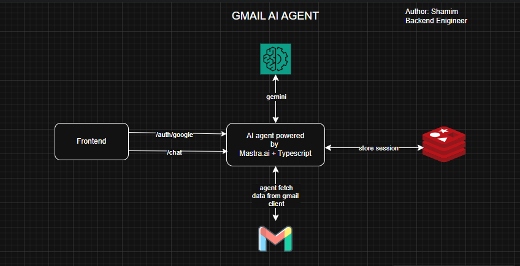

# Gmail AI Agent (Local Setup Guide)

This project is a **simple AI agent** that can access a user’s Gmail (with permission) and respond to chat prompts like *“list unread emails”*.

**Important:**
This project is **only for local testing and demonstration purposes**.
It is **NOT production-ready** and **should not be deployed to production environments**.

---

## Tech Stack

* Backend: Node.js, TypeScript, Mastra AI, passport auth, Gemini
* Frontend: React, Vite, Tailwind CSS
* Auth: Google OAuth
* Cache/Session: Redis (Docker)
* AI Rendering: React Markdown

---

## Prerequisites

Make sure you have installed:

* Node.js (v18+ recommended)
* Docker & Docker Compose
* Google Cloud OAuth credentials
* Gmail API enabled
* Gemini API key

---

## 1. Start Redis Using Docker

Redis is required for session management.

```bash
docker run -d \
  --name redis \
  -p 6379:6379 \
  redis:7-alpine
```

Verify Redis is running:

```bash
docker ps
```

---

## 2. Backend Environment Variables

Create a `.env` file inside the **backend** directory.

### `backend/.env.example`

```env
GOOGLE_GENERATIVE_AI_API_KEY=""

PORT=3000

GOOGLE_CLIENT_ID=""
GOOGLE_CLIENT_SECRET=""

GEMINI_API_KEY=""
```

Notes:

* Use **Google OAuth Web Client credentials**
* Redirect URI must be:

  ```
  http://localhost:3000/api/auth/callback/google
  ```
* Gmail API must be enabled in Google Cloud Console

---

## 3. Start Backend Server

```bash
cd backend
npm install
npm run dev
```

Backend will start at:

```
http://localhost:3000
```

---

## 4. Frontend Environment Variables

Create a `.env` file inside the **frontend** directory.

### `frontend/.env.example`

```env
VITE_BASE_URL=http://localhost:3000
```

---

## 5. Start Frontend Application

```bash
cd frontend
npm install
npm run dev
```

Frontend will start at:

```
http://localhost:5173
```

---

## Application Flow

1. Open `http://localhost:5173/login`
2. Click **Sign in with Google**
3. Grant Gmail read permission
4. Redirect to `/chat`
5. Ask:

   ```
   list unread emails
   ```
6. AI agent responds using Gmail data

---

## Important Disclaimer

* This project is **for local testing only**
* OAuth, cookies, CORS, and session handling are **not hardened**
* No production security practices applied
* Do **NOT** deploy as-is

---

## Project Status

✔ Backend complete
✔ Frontend complete
✔ Gmail OAuth working
✔ AI agent responding
✔ Dockerized Redis
✔ Assignment ready